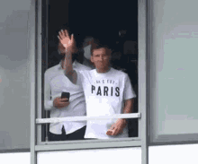

# 
 Homework OOP  - GwentStone
 

  
  

        &emsp; Bună! Hello! Bonjour! Hola! Olá! This document explains the implementation of an invented game "GwentStone",
    in Java. For more details about the game, <a href="https://ocw.cs.pub.ro/courses/poo-ca-cd/teme/2024/tema"> click here</a>.
    Summarily, this is a tactical card game which can take place just between 2 players. During the code, I was "forced"
    to describe the players as "enemies" as to receive all the points. I would argue that this is a bad word to be chosen
    in this context. The players are rivals, but not enemies.  
        &emsp; The implementation is divided in 5 packages: main, cards, input, gameprogress, output. If you want to see the uml diagram of the code, <a href="https://lucid.app/lucidchart/f9d6551a-d4df-49ab-af82-57da18d14af3/edit?viewport_loc=-2762%2C-13106%2C7400%2C3656%2CHWEp-vi-RSFO&invitationId=inv_f6ed71e2-86a5-4f8d-8728-e0c48f89b947">
    click here</a>. I did not mention the constructors, the getters, the setters and the relations of asociation
    , to keep the diagram as essy to understand as possible. 
  

     
        All the information from the input file are stored in an object of type "Input". When we  
        start a new game, we take the useful information from there and work with just 3 variables:
    <ul>
        <li>an object of type "Game", which we name it "currentGame"; in this one, we save  
            the data about the current state of the game and about the games which finished </li>
        <li>an array of actions which were read from the input file</li>
        <li>an array node which help us to save the output and at final to write it in a file</li>
    </ul>
        For every action, we call the method "handle". This function decides if we work with an action  
        of type "get some information about the game" or one of the type "do something to progress the  
        game". Depending on the type, we go at the method handleGetAction() or handleDoAction(). These  
        two functions, call further methods from the package "gameprogress", with the purpose of realizing  
        the action. If it's the case, the two methods use the package "output" to show something to the user.

